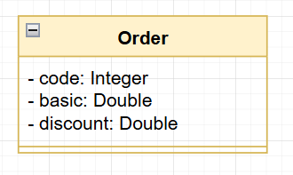
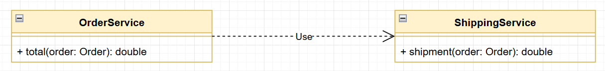

# DESAFIO: Componentes e injeção de dependência

Você deve criar um sistema para calcular o valor total de um pedido, considerando uma porcentagem
de desconto e o frete. O cálculo do valor total do pedido consiste em aplicar o desconto ao valor
básico do pedido, e adicionar o valor do frete. A regra para cálculo do frete é a seguinte:

| Valor básico do pedido (sem desconto)      | Frete |
| ----------- | ----------- |
| Abaixo de R$ 100.00      | R$ 20.00      |
| De R$ 100.00 até R$ 200.00 inclusive  | R$ 12.00       |
| R$ 200.00 ou mais | Grátis |

### Exemplo 1:

|ENTRADA (dados do pedido: código, valor básico, porcentagem de desconto)| SAÍDA |
| ---------------------------------------------------------------------- | ----- |
|1034  | Pedido código 1034 |
|150.00 | Valor total: R$ 132.00 |
|20.0| |

### Exemplo 2:

|ENTRADA (dados do pedido: código, valor básico, porcentagem de desconto)| SAÍDA |
| ---------------------------------------------------------------------- | ----- |
|2282  | Pedido código 2282 |
|800.00 | Valor total: R$ 720.00 |
|10.0| |

### Exemplo 3:

|ENTRADA (dados do pedido: código, valor básico, porcentagem de desconto)| SAÍDA |
| ---------------------------------------------------------------------- | ----- |
|1309  | Pedido código 1309 |
|95.90 | Valor total: R$ 115.90 |
|0.0| |

Sua solução deverá seguir as seguintes especificações:

Um pedido deve ser representado por um objeto conforme projeto abaixo:

A lógica do cálculo do valor total do pedido deve ser implementada por componentes (serviços), cada um com sua responsabilidade, conforme projeto abaixo:

*Serviço OrderService*: responsável por operações referentes a pedidos.

*Serviço ShippingService*: responsável por operações referentes a frete.

Sua solução deverá ser implementada em Java com Spring Boot. A saída deverá ser mostrada no log
do terminal da aplicação. Cada serviço deve ser implementado como um componente registrado com
`@Service`.